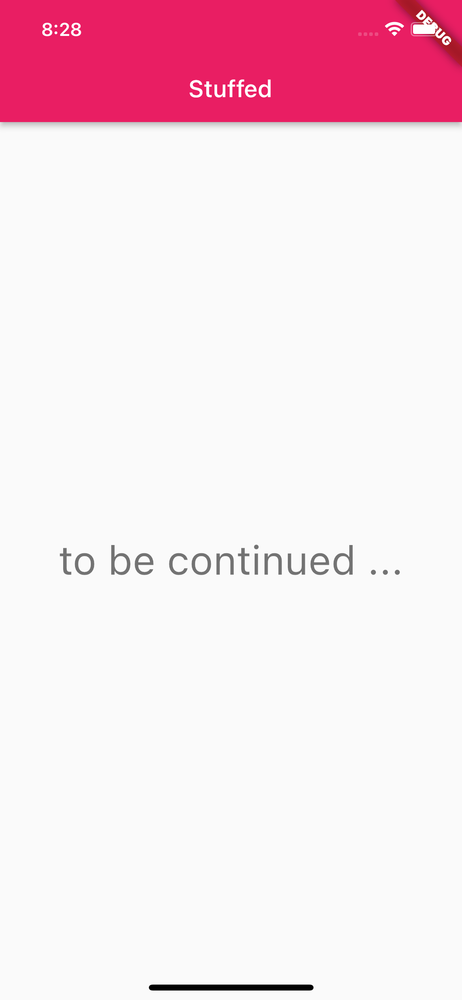

# Stuffed

An small application to manage an inventory of perishable stuff.

>It is one of several projects which could solve real problems and get used by real users, but their real objective is to help me learn [dart](https://dart.dev) and [flutter](https://flutter.dev). The other projects are: [flow](https://github.com/michalporeba/flow), [pataiu](https://github.com/michalporeba/pataiu) and [ticks](https://github.com/michalporeba/stuffed). 

&nbsp;
## Problem domain

Managing a small inventory of stuff that has a tendency of going out of date. 
To make it more interesting, I expect it will connect with [ticks](https://github.com/michalporeba/stuffed).

&nbsp;
## The result
So far it looks as unimpressive as this:

